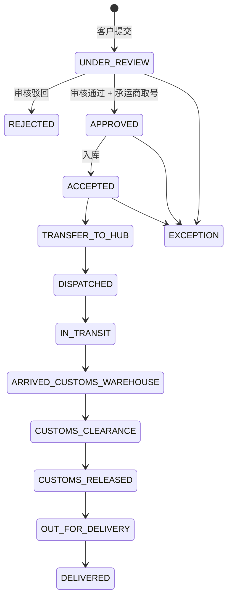
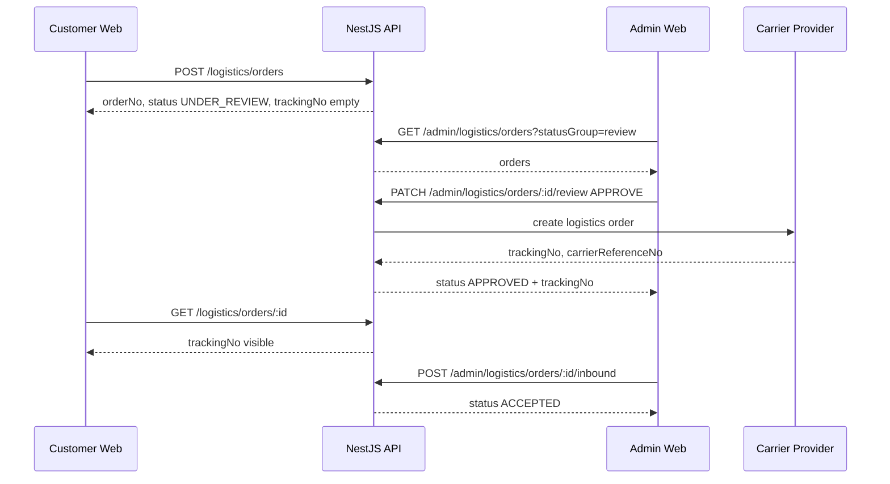
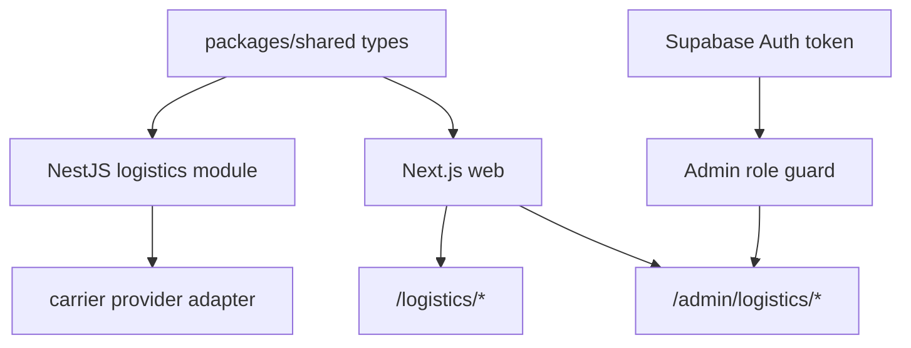

# 后台物流订单审核与状态筛选实施计划

## 0. 背景与结论

本次需求属于 GStack 场景 A：后台物流核心流程调整，涉及前台下单、后台审核、承运商取号、入库、用户端展示、后台筛选与权限边界。

结论：后台不应只是“隐藏入口”，还必须有真实权限隔离。前台导航移除 `/admin`，但 `/admin` 作为直接访问入口保留；所有后台 API 必须同时满足 Supabase token 有效与 `role=admin`，否则拒绝访问。

## 1. CEO Review

### 1.1 业务价值

- 把客户下单后的风险控制前置到人工审核，避免错误地址、申报、税号、重量尺寸直接进入履约链路。
- 审核通过后再生成物流单号，客户看到的单号代表订单已经进入可履约状态，减少“有单号但后台未确认”的客服成本。
- 入库被放在审核之后，仓库只处理已审核订单，降低错收、漏收、重复入库。
- 物流状态筛选让运营按待处理队列工作，而不是在全量订单里人工找单。

### 1.2 用户核心路径

1. 客户在 `/logistics/orders/new` 创建订单。
2. 订单进入 `UNDER_REVIEW`，用户端显示订单号，物流单号显示“待生成”。
3. 管理员通过隐藏入口 `/admin` 进入后台。
4. 管理员在 `/admin/logistics/orders` 看到待审核订单，打开详情页核对发件人、收件人、货物、申报、重量尺寸。
5. 管理员审核通过后，系统调用承运商 provider adapter 创建物流订单并回写 `trackingNo` / `carrierReferenceNo`。
6. 用户端订单详情和轨迹查询开始显示物流单号。
7. 审核通过的订单才允许执行入库操作，入库后进入后续运输状态流转。
8. 管理员可按“待发运 / 国际运输中 / 尾端派送中”等状态组筛选订单。

### 1.3 Edge Cases

- 承运商 API 未配置或调用失败：审核不能静默成功；订单保留审核前状态或进入“审核通过但取号失败”的可重试状态。
- 重复点击审核通过：接口必须幂等，已有物流单号时不重复向承运商创建订单。
- 被驳回订单：不允许入库、不允许创建承运商单号，用户端看到“已驳回”和驳回原因。
- 未审核订单执行入库：后端拒绝，前端按钮 disabled 并显示原因。
- 管理员 token 有效但角色不是 admin：后台 API 返回 403。
- 用户端直接请求后台接口：返回 401/403，不泄露订单列表。
- 状态筛选为空：显示空状态，不显示错误。
- 旧 seed 数据已有 `trackingNo`：保留为已审核后的样例，新增未审核样例不带 `trackingNo`。

### 1.4 产品参考矩阵

| 模块 | 当前问题 | 目标行为 | MVP 边界 |
| --- | --- | --- | --- |
| 前台导航 | 顶部直接显示“后台” | 用户不可见，管理员直接访问 `/admin` | 不做复杂后台入口发现机制 |
| 下单 | 创建订单时立即生成物流单号 | 仅生成业务订单号，物流单号待审核后生成 | 不接在线支付 |
| 审核 | 后台详情页按钮无真实动作 | 审核通过 / 驳回接 API，有 loading/error | 审核表单只支持原因与重量尺寸修正 |
| 入库 | 没有审核前置限制 | 只有审核通过订单可入库 | 入库先用 `ACCEPTED` 表示货物接收 |
| 取号 | 只有 last-mile provider stub | 审核通过时通过 provider adapter 生成客户可见物流单号 | provider 继续 typed stub，等待真实 API 文档 |
| 筛选 | 后台只能看全量订单 | 支持状态组筛选 | 先做内存服务 + query 参数，不锁死数据库表 |

## 2. Eng Review

### 2.1 当前代码事实

- `apps/api/src/modules/logistics/logistics.service.ts`
  - `createOrder()` 现在会立即生成 `trackingNo`，需要改为审核后生成。
  - `reviewOrder()` 已存在，但只改状态，不调用承运商取号。
  - `listOrders()` 不支持 query 筛选。
- `apps/api/src/modules/logistics/admin-logistics.controller.ts`
  - 后台接口挂了 `SupabaseTokenGuard`，但目前没有强制 `role=admin`。
- `apps/web/app/admin/logistics/orders/AdminLogisticsOrdersClient.tsx`
  - 后台订单列表当前调用公开 `/logistics/orders`，需要改为 `/admin/logistics/orders` 并携带 token。
  - 当前没有状态组筛选控件。
- `apps/web/app/admin/logistics/orders/[id]/page.tsx`
  - 详情页是静态按钮，没有客户端 API 行为。
- `apps/web/components/SiteChrome.tsx`
  - 顶部导航暴露 `/admin`，需要移除。
- `packages/shared/src/types.ts` 与 `supabase/schema.sql`
  - 当前状态没有独立的 `APPROVED`。为表达“审核通过但未入库”，建议新增 `APPROVED`。

### 2.2 建议状态机

### 2.3 状态组筛选定义

| 筛选项 | 包含状态 |
| --- | --- |
| 全部 | 全部订单 |
| 待审核 | `UNDER_REVIEW` |
| 待发运 | `APPROVED`, `ACCEPTED`, `TRANSFER_TO_HUB` |
| 国际运输中 | `DISPATCHED`, `IN_TRANSIT`, `ARRIVED_CUSTOMS_WAREHOUSE`, `CUSTOMS_CLEARANCE`, `CUSTOMS_RELEASED` |
| 尾端派送中 | `OUT_FOR_DELIVERY` |
| 已完成 | `DELIVERED` |
| 异常 / 驳回 | `EXCEPTION`, `REJECTED` |

### 2.4 API 设计

- `GET /admin/logistics/orders?statusGroup=pending-shipment`
  - 管理员订单列表，支持状态组筛选。
- `GET /admin/logistics/orders/:id`
  - 管理员订单详情。
- `PATCH /admin/logistics/orders/:id/review`
  - body: `{ decision, reason?, correctedWeightKg?, correctedLengthCm?, correctedWidthCm?, correctedHeightCm? }`
  - `APPROVE`：调用 provider adapter 创建物流单号，状态改为 `APPROVED`，追加审核通过事件。
  - `REJECT`：状态改为 `REJECTED`，不生成物流单号。
- `POST /admin/logistics/orders/:id/inbound`
  - 仅允许 `APPROVED` 状态执行，成功后状态改为 `ACCEPTED`。
- `POST /admin/logistics/orders/:id/tracking-events`
  - 保留现有人工轨迹接口。

### 2.5 文件清单

#### 后端

- `apps/api/src/modules/auth/admin-role.guard.ts`
  - 新增管理员角色 guard。
- `apps/api/src/modules/logistics/logistics.service.ts`
  - 下单不生成 `trackingNo`。
  - 审核通过后调用 provider 取号。
  - 新增状态组筛选和入库方法。
- `apps/api/src/modules/logistics/admin-logistics.controller.ts`
  - 使用管理员 guard。
  - 支持 `statusGroup` query。
  - 新增入库 endpoint。
- `apps/api/src/modules/carrier/fixed-carrier.provider.ts`
  - 新增通用 `createLogisticsOrder()` 或扩展当前创建方法，返回客户可见物流单号与承运商引用号。
- `packages/shared/src/types.ts`
  - 新增 `APPROVED` 与 `LogisticsStatusGroup` 类型。
- `packages/shared/src/schemas.ts`
  - 如前端需要共享筛选参数，补状态组 schema。
- `packages/shared/src/seed-data.ts`
  - 增加一个 `UNDER_REVIEW` 无物流单号样例。
- `supabase/schema.sql`
  - `logistics_status` enum 增加 `APPROVED`。
  - 可选增加 `reviewed_at`, `reviewed_by`, `review_note`，如本轮保持 seed/in-memory，可先放入 `metadata`。

#### 前端

- `apps/web/components/SiteChrome.tsx`
  - 移除顶部 `/admin` 导航。
- `apps/web/lib/api.ts`
  - 增加 `patchJson()` 与可携带 Authorization 的 admin request helper。
- `apps/web/app/admin/logistics/orders/AdminLogisticsOrdersClient.tsx`
  - 调用 `/admin/logistics/orders`。
  - 增加状态组筛选控件、刷新、空状态。
- `apps/web/app/admin/logistics/orders/[id]/page.tsx`
  - 改为渲染客户端详情组件。
- `apps/web/app/admin/logistics/orders/[id]/AdminLogisticsOrderDetailClient.tsx`
  - 审核通过、驳回、入库、错误反馈、禁用状态。
- `apps/web/components/StatusBadge.tsx`
  - 支持 `APPROVED`。
- `apps/web/lib/i18n.ts`
  - 中 / 英 / 俄补文案。

### 2.6 数据流

### 2.7 依赖图

### 2.8 复杂度评估

- 后端状态机与幂等：中等风险。
- 前端后台详情页改客户端交互：中等风险。
- Supabase admin 角色校验：中等风险，取决于当前登录 token 是否已写入 `app_metadata.role`。
- 数据库 enum 增加 `APPROVED`：低到中等风险，生产库需要 migration 顺序。
- 真实承运商 API：本轮只接 typed stub，低风险。

## 3. 验收标准

- 普通用户顶部导航看不到“后台”。
- 普通用户无法访问后台 API。
- 客户创建物流订单后，订单状态为 `UNDER_REVIEW`，没有 `trackingNo`。
- 管理员审核通过后，系统生成物流单号；用户端能看到该单号。
- 未审核或驳回订单不能入库。
- 审核通过订单可以入库，入库后状态变为 `ACCEPTED`。
- 后台订单列表可按待审核、待发运、国际运输中、尾端派送中筛选。
- `npm run build` 通过。
- `npm run check:residuals` 通过。

## 4. 实施任务清单

1. 后端补管理员 guard 与后台 API 权限。
2. 后端改订单创建、审核取号、入库、状态组筛选。
3. 共享类型与 seed 数据补状态和筛选定义。
4. 前台移除可见后台入口。
5. 后台列表接 admin API 并加入筛选。
6. 后台详情页接审核 / 驳回 / 入库操作。
7. 补多语言文案。
8. 构建与残留检查。

## 5. 需要用户确认

请确认是否接受新增 `APPROVED` 状态来区分“审核通过已取号”和“已入库”。如果不新增状态，也可以复用 `ACCEPTED`，但那会让“审核通过”和“入库”在数据层混在一起，后续运营筛选会变钝。
