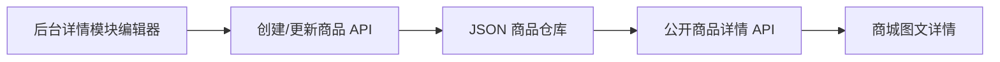

# 商品详情图文内容实施计划

## 目标与成功标准

管理员在新建或编辑商品时，可以添加多个按顺序展示的详情模块。每个模块包含标题、正文和一张可选图片；保存后商城商品详情区按相同顺序展示图文内容。

验收标准：

- 新建与编辑商品页面新增“详情内容”分区。
- 管理员可以添加、删除多个详情模块。
- 每个模块支持标题、正文和 JPG/PNG/WebP 图片。
- 图片选择后可预览、移除或重新选择，单张不超过 2 MB。
- 编辑已有商品时完整回填详情标题、正文和图片。
- 商城详情页按录入顺序显示文字与图片。
- 没有详情模块时显示“暂无商品详情”，不再留下空白区域。
- 保存和 API 重启后图文详情仍然存在。

## CEO Review

### 业务价值

- 商品页可以展示材质、尺寸、使用场景、包装等真正影响购买决策的信息。
- 运营人员不需要修改代码即可维护详情内容。
- 图文模块比单一富文本编辑器更稳定，适合当前轻量商品后台。

### 用户路径

1. 管理员进入新建或编辑商品页。
2. 在“详情内容”中添加模块。
3. 填写标题、正文，可选上传一张说明图片。
4. 继续添加下一模块，页面按当前列表顺序保存。
5. 保存商品后进入商城详情页查看图文内容。

### Edge Cases

- 模块标题或正文为空：阻止保存并明确提示。
- 图片类型不支持、单张超过 2 MB：阻止选择并保留其他表单内容。
- 图片读取或 API 保存失败：显示错误，不静默丢失模块。
- 删除所有详情模块：允许保存，商城显示明确空状态。
- 已有老商品没有详情数据：继续兼容，不影响商品打开。

## Eng Review

### 数据结构

扩展现有 `Product.detailSections`：

```ts
Array<{
  title: string;
  body: string;
  imageUrl?: string;
}>
```

现有 seed 商品只有文字字段，可直接兼容；新商品可以附加图片。

### 文件改动

- `packages/shared/src/types.ts`
  - 为详情模块增加可选 `imageUrl`。
- `apps/api/src/modules/shop/dto/create-product.dto.ts`
  - 增加嵌套详情模块校验，最多 12 个模块。
- `apps/api/src/modules/shop/shop.service.test.ts`
  - TDD 验证图文详情创建、更新与重启持久化。
- `apps/web/app/admin/shop/products/new/ProductForm.tsx`
  - 新增详情模块状态、动态增删、图片选择/预览与提交。
- `apps/web/app/shop/products/[slug]/ProductDetailClient.tsx`
  - 渲染详情标题、正文和图片；无数据时显示空状态。
- `apps/web/app/globals.css`
  - 增加详情编辑器和商城图文模块样式。

### 数据流



### 范围边界

- 本轮采用结构化图文模块，不引入富文本 HTML、Markdown、视频或拖拽排序。
- 模块顺序就是后台当前添加顺序。
- 继续复用现有图片 data URL 持久化方案和大小限制。

## 验证计划

1. 先写失败测试，再实现共享类型与 API 校验。
2. 新建一个含两段文字和一张图片的商品，确认商城顺序与内容。
3. 编辑详情文字、替换图片并删除一个模块，确认商城同步。
4. 验证无详情商品的空状态。
5. 重启 API，确认详情内容仍存在。
6. 运行类型检查、全仓构建和浏览器错误检查。

