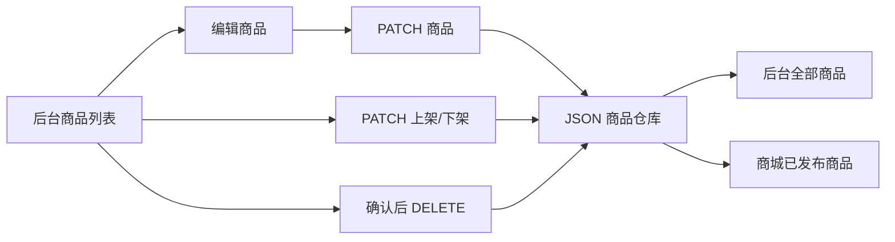

# 商品编辑、下架与删除实施计划

## 目标与成功标准

管理员可以从商品管理列表进入编辑页，修改商品资料、图片、SKU 和发布状态；保存后后台与商城立即使用新数据。管理员可以将商品下架，也可以在二次确认后永久删除商品。

验收标准：

- 每个后台商品行都有“编辑”“下架/上架”“删除”操作。
- 编辑页回填现有名称、slug、分类、摘要、描述、图片、SKU、币种、库存和发布状态。
- 保存修改后刷新或重启 API，数据仍然存在。
- 下架商品保留在后台，但从商城列表和公开详情接口消失。
- 上架商品重新出现在商城。
- 删除操作必须二次确认；成功后商品从后台和商城消失。
- API 失败时展示可见错误，不从列表中静默移除商品。

## CEO Review

### 业务价值

- 商品录入不再是一次性操作，运营人员可以修正价格、图片、文案与库存。
- “下架”保留商品资料，适合临时停售；“删除”用于错误录入或确定不再使用的商品。
- 操作直接位于商品列表，减少后台管理路径。

### 核心路径

1. 管理员在商品列表点击“编辑”，进入 `/admin/shop/products/[id]/edit`。
2. 页面加载完整商品资料并允许修改。
3. 点击保存后返回商品列表，显示成功反馈。
4. 点击“下架”后商品状态变为草稿，商城立即隐藏。
5. 点击“删除”后出现明确确认框；确认后永久删除。

### Edge Cases

- 商品不存在或已被删除：编辑页显示错误并提供返回列表入口。
- 修改 slug 与其他商品重复：后端返回冲突错误，保留表单内容。
- 删除/下架请求失败：恢复按钮状态并显示错误。
- 删除已有历史订单引用的商品：订单保存的是商品与 SKU ID 快照，本轮允许删除商品，但不修改历史订单记录。
- 正在编辑时商品被另一操作删除：保存返回 404。

## Eng Review

### API

- `GET /admin/shop/products/:id`：获取草稿或已发布商品。
- `PATCH /admin/shop/products/:id`：更新完整商品数据，保留商品 ID；SKU 由后端重新生成 ID。
- `PATCH /admin/shop/products/:id/status`：上架或下架。
- `DELETE /admin/shop/products/:id`：永久删除。

### 文件改动

- `packages/shared/src/types.ts`
  - 增加更新商品与发布状态输入类型。
- `apps/api/src/modules/shop/dto/create-product.dto.ts`
  - 复用商品字段校验，增加状态 DTO。
- `apps/api/src/modules/shop/admin-shop.controller.ts`
  - 增加管理员详情、更新、状态和删除接口。
- `apps/api/src/modules/shop/shop.service.ts`
  - 增加查询、更新、状态切换和删除；所有写操作先原子持久化，再更新内存。
- `apps/api/src/modules/shop/shop.service.test.ts`
  - TDD 覆盖更新、重复 slug、下架、上架、删除与写入失败。
- `apps/web/lib/api.ts`
  - 增加管理员 DELETE 请求封装。
- `apps/web/app/admin/shop/products/new/ProductForm.tsx`
  - 改造成新建/编辑共用表单，支持初始商品数据和 PATCH 提交。
- `apps/web/app/admin/shop/products/[id]/edit/page.tsx`
  - 编辑商品入口。
- `apps/web/app/admin/shop/products/[id]/edit/ProductEditLoader.tsx`
  - 加载管理员商品详情及错误状态。
- `apps/web/app/admin/shop/products/ProductAdminList.tsx`
  - 增加编辑、上架/下架、删除及操作反馈。
- `apps/web/app/globals.css`
  - 仅补充列表操作区和危险操作确认样式。

### 数据流

### 范围边界

- 本轮删除为永久删除，必须二次确认。
- 本轮不做回收站、批量操作、编辑历史或并发版本锁。
- 继续使用已批准的单实例后端 JSON 持久化，后续迁移 Supabase 时保持 API 形状。

## 验证计划

1. 先写失败测试，再实现服务层更新、状态切换和删除。
2. 运行 API/Web 类型检查、全仓构建和残留检查。
3. 在 `localhost:3000` 实测编辑价格与图片、下架、重新上架、删除取消和删除确认。
4. 重启 API，确认更新与删除结果仍然存在。

