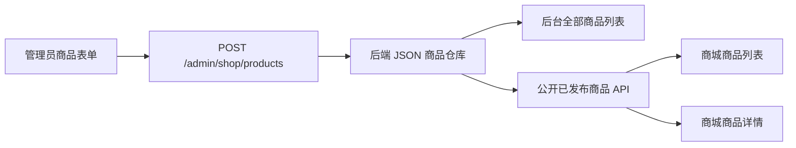

# 管理端商品新建与商城展示实施计划

## 目标与成功标准

管理员能在 `/admin/shop/products/new` 填写商品资料、选择封面图和详情图、配置至少一个 SKU，并选择草稿或发布状态。提交成功后，商品出现在后台商品列表；已发布商品出现在 `/shop`、`/shop/products` 和商品详情页，草稿只在后台可见。

本轮按最小可行范围实现“新建 + 列表 + 发布控制”。图片管理包含新建时预览、移除和排序后的提交；不包含已保存商品的编辑、删除、图片裁剪或云端媒体库。

## 现状与根因

- `/admin/shop/products/new` 当前仅渲染 `PageHero`，不存在表单或提交逻辑。
- `ShopController` 只有公开查询商品和创建订单接口，没有管理员创建商品接口。
- API 的 `ShopService` 只在内存中加载 `sampleProducts`，进程重启后无法保存新增数据。
- 后台商品列表、商城列表和商品详情页都直接读取 `sampleProducts`，没有共享同一个运行时数据源。
- `supabase/schema.sql` 已定义商品和 SKU 表，但运行项目没有 Supabase 数据库或 Storage 客户端；直接接入会增加环境配置与上线依赖。
- 当前全仓构建通过，故障不是编译失败，而是功能链路尚未实现。

## CEO Review

### 业务价值

- 解除商品内容依赖开发人员改 seed 文件和重新构建的限制。
- 建立“后台录入 → 发布控制 → 商城展示”的最短运营闭环。
- 保留与未来 Supabase 商品表和 Storage 相同的业务数据形状，减少后续迁移成本。

### 用户核心路径

1. 管理员进入商品管理并点击“新建商品”。
2. 填写名称、slug、分类、摘要、描述和展示信息。
3. 选择一张封面图，可选添加多张详情图；页面即时预览并允许移除。
4. 添加至少一个 SKU，填写型号、尺寸、价格、币种和库存说明。
5. 选择“草稿”或“立即发布”，点击保存。
6. 保存期间按钮进入 loading/disabled 状态；成功后跳转后台商品列表并显示新商品。
7. 已发布商品在商城列表和详情页可访问；草稿不会泄露到商城。

### Edge Cases

- 必填项、价格或 SKU 不合法：表单内展示明确错误，不发送请求。
- slug 重复：后端拒绝创建，并在页面显示可读错误。
- 未选择封面图或图片过大/类型不支持：阻止提交并提示限制。
- 多次点击保存：提交按钮禁用，避免重复商品。
- API 不可用或持久化失败：保留表单内容并显示错误，不静默失败。
- 商品没有发布：后台可见，公开列表和详情接口不可见。
- 商品 API 暂时失败：商城显示错误状态，不回退到可能过期的静态商品。

### 产品范围矩阵

| 能力 | 本轮 | 后续 |
| --- | --- | --- |
| 新建商品 | 是 | — |
| 封面图与多图预览、移除 | 是 | — |
| SKU 动态增删 | 是 | — |
| 草稿/发布 | 是 | — |
| 后台商品列表 | 是 | 增加筛选、分页 |
| 编辑已保存商品 | 否 | 独立迭代 |
| 删除/归档商品 | 否 | 独立迭代，需二次确认 |
| 图片裁剪、云媒体库 | 否 | 接入 Storage 时处理 |
| Supabase 持久化 | 否 | 环境准备完成后替换 mock store |

## Eng Review

### 技术方案

采用后端自有、可持久化的 mock 商品仓库：

- API 启动时以 `sampleProducts` 为初始数据，并把管理员新增商品写入本地 JSON 数据文件。
- 图片在前端校验后编码为受大小限制的 data URL，作为商品图片字段提交并由后端数据文件保存。
- 公开商品接口仅返回已发布商品；管理员接口在现有管理员守卫后返回全部商品并允许创建。
- Next.js 商城页面改为在运行时读取 API，不再直接依赖静态 seed。
- 数据结构继续使用共享 `Product` 类型，后续替换 Supabase repository 时保持页面和接口形状不变。

该方案适用于当前脚手架/单实例开发环境。多实例部署、对象存储和生产级数据库持久化不在本轮范围内。

### API 约定

- `GET /shop/products`：返回已发布商品。
- `GET /shop/products/:slug`：只返回已发布商品；草稿返回 404。
- `GET /admin/shop/products`：管理员鉴权后返回全部商品。
- `POST /admin/shop/products`：管理员鉴权后校验并创建商品。

### 文件清单

- `packages/shared/src/types.ts`
  - 增加创建商品输入类型，复用现有分类、币种和 SKU 类型。
- `apps/api/src/modules/shop/dto/create-product.dto.ts`
  - 声明后端输入校验规则与嵌套 SKU 校验。
- `apps/api/src/modules/shop/product.repository.ts`
  - 封装 seed 初始化、JSON 读取和原子写入。
- `apps/api/src/modules/shop/product.repository.test.ts`
  - 用临时目录验证初始化、创建、重复 slug 与重载持久化。
- `apps/api/src/modules/shop/shop.service.ts`
  - 区分公开与管理员商品查询，增加创建商品逻辑。
- `apps/api/src/modules/shop/shop.controller.ts`
  - 保留公开读取接口。
- `apps/api/src/modules/shop/admin-shop.controller.ts`
  - 添加受管理员守卫保护的列表与创建接口。
- `apps/api/src/modules/shop/shop.module.ts`
  - 注册管理员控制器和商品 repository。
- `apps/api/src/main.ts`
  - 将 JSON 请求体限制调整到受控图片大小所需范围。
- `apps/web/lib/api.ts`
  - 复用现有公开/管理员请求封装，不新增第三方客户端。
- `apps/web/app/admin/shop/products/new/ProductForm.tsx`
  - 商品字段、图片预览/移除、SKU 动态增删、校验及提交反馈。
- `apps/web/app/admin/shop/products/new/page.tsx`
  - 渲染新建表单。
- `apps/web/app/admin/shop/products/ProductAdminList.tsx`
  - 请求管理员商品列表并呈现 loading/error/empty 状态。
- `apps/web/app/admin/shop/products/page.tsx`
  - 改为后台动态列表入口。
- `apps/web/app/shop/ShopProductCatalog.tsx`
  - 统一公开商品请求与 loading/error/empty 状态，供商城首页和商品页复用。
- `apps/web/app/shop/page.tsx`
  - 使用公开 API 商品目录。
- `apps/web/app/shop/products/page.tsx`
  - 使用公开 API 商品目录。
- `apps/web/app/shop/products/[slug]/page.tsx`
  - 运行时读取商品详情和相关推荐。
- `apps/web/app/globals.css`
  - 仅增加商品表单、图片预览和后台列表需要的样式。
- `apps/web/lib/i18n.ts`
  - 增加表单、状态与错误反馈文案。

### 数据流

### 复杂度与风险

- 中等复杂度，主要在图片体积、嵌套 SKU 校验和服务端/客户端数据读取边界。
- data URL 会放大图片体积，必须限制图片数量、单图大小与总请求体大小。
- JSON 文件仓库只保证单进程写入，不支持多实例并发；这是 mock 阶段的明确限制。
- 工作区已有大量未提交改动，实施时只触碰上述文件，并逐处核对 `types.ts`、`globals.css` 和 `i18n.ts` 的现有用户改动。

## 验证计划

1. 按 TDD 先写商品 repository/API 失败测试，再实现持久化与创建逻辑。
2. 运行 API 单元测试与全仓类型检查。
3. 运行 `npm run build` 和 `npm run check:residuals`。
4. 启动 API 与 Web，管理员实际创建一个已发布商品：
   - 图片预览、SKU 增删、提交反馈均正常。
   - 后台列表出现该商品。
   - 商城列表出现该商品。
   - 商品详情页可打开并显示图片与 SKU。
5. 创建一个草稿商品，确认只在后台可见且公开详情返回 404。
6. 重启 API，确认新增商品仍存在。

