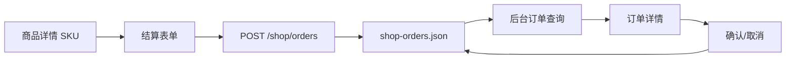

# 电商订单提交、查询与确认实施计划

## 目标与成功标准

客户从商品详情进入结算页并提交真实订单后，订单必须持久化；管理员可以在“电商管理 → 订单管理”搜索、筛选、查看订单明细，并确认或取消待确认订单。

验收标准：

- 商品详情页将真实 `productId`、`skuId` 和数量传入结算页。
- 结算页展示所选商品/SKU，填写完整收件信息后调用 `POST /shop/orders`。
- 提交成功后显示真实订单号，而不是模拟成功提示。
- API 重启后订单仍然存在。
- 后台订单列表展示订单号、时间、收件人、金额、状态，并支持关键词和状态筛选。
- 管理员可以查看商品快照、SKU、数量、单价和完整收件地址。
- 待确认订单可以“确认订单”或“取消订单”；完成后列表和详情即时更新。
- 非管理员不能访问后台订单接口。

## 现状与根因

- `CheckoutForm.tsx` 只执行 400ms 延时，不调用任何 API。
- 商品详情页传递的是商品名称和 SKU 文本，不是可验证的商品/SKU ID。
- `/admin/shop/orders` 使用硬编码演示订单，没有读取后端。
- `ShopService.orders` 是内存数组，API 重启后订单全部丢失。
- 后端没有受管理员鉴权保护的订单查询、详情或确认接口。

## CEO Review

### 业务价值

- 建立“客户下单 → 后台接单 → 人工确认”的真实交易闭环。
- 管理员能按订单号、收件人、电话和状态快速定位订单。
- 订单保存商品快照，商品后续修改或删除不会破坏历史订单信息。

### 核心路径

1. 客户在商品详情页选择 SKU 和数量，进入结算。
2. 结算页校验商品仍然存在且已发布，客户填写完整收件资料。
3. 提交后生成真实订单号，状态为“待人工确认”。
4. 管理员进入订单管理，通过关键词或状态找到订单。
5. 管理员查看商品、价格、数量、收件人和地址。
6. 管理员确认订单，状态变为“已确认”；或取消无效订单。

### Edge Cases

- 商品/SKU 已下架、删除或不存在：结算页阻止提交并提示返回商品列表。
- 数量小于 1、收件信息不完整：前后端都拒绝提交。
- 不同币种 SKU 同时提交：本轮拒绝混合币种订单。
- 重复点击提交/确认：按钮进入 loading/disabled，避免重复操作。
- 已确认或已取消订单：不再显示可重复确认/取消操作。
- 商品之后被编辑或删除：订单继续显示创建时的商品名称、图片和 SKU 快照。
- API 请求失败：保留表单或当前筛选条件并显示错误。

## Eng Review

### 数据结构

扩展 `ShopOrderItem`，保存下单时快照：

```ts
{
  productId: string;
  productName: string;
  productSlug: string;
  productImageUrl: string;
  skuId: string;
  skuModel: string;
  skuSize: string;
  quantity: number;
  unitPrice: number;
}
```

订单继续使用现有状态：

- `PENDING_CONFIRMATION`
- `CONFIRMED`
- `CANCELLED`
- `LINKED_TO_LOGISTICS` 保留给后续物流桥接，本轮不实现。

### API

- `POST /shop/orders`：创建并持久化订单。
- `GET /admin/shop/orders`：管理员查询全部订单。
- `GET /admin/shop/orders/:id`：管理员查看订单详情。
- `PATCH /admin/shop/orders/:id/status`：管理员确认或取消订单。

### 文件改动

- `packages/shared/src/types.ts`
  - 扩展订单商品快照字段。
- `apps/api/src/modules/shop/dto/update-shop-order-status.dto.ts`
  - 限制管理员状态操作为确认或取消。
- `apps/api/src/modules/shop/shop.service.ts`
  - 加载/原子保存 `shop-orders.json`；创建订单快照；增加管理员查询、详情和状态更新。
- `apps/api/src/modules/shop/shop.service.test.ts`
  - TDD 覆盖创建持久化、商品快照、重启加载、确认、取消、非法状态与写盘失败。
- `apps/api/src/modules/shop/admin-shop.controller.ts`
  - 增加管理员订单列表、详情和状态接口。
- `.gitignore`
  - 忽略运行时订单数据文件。
- `apps/web/app/shop/products/[slug]/ProductDetailClient.tsx`
  - 结算链接改传真实 ID。
- `apps/web/app/shop/checkout/CheckoutForm.tsx`
  - 加载商品、填写完整地址、提交真实订单并显示订单号。
- `apps/web/app/admin/shop/orders/AdminShopOrdersClient.tsx`
  - 订单搜索、状态筛选、loading/error/empty 和确认/取消。
- `apps/web/app/admin/shop/orders/page.tsx`
  - 使用真实订单管理组件。
- `apps/web/app/admin/shop/orders/[id]/AdminShopOrderDetailClient.tsx`
  - 展示商品快照、金额和收件信息，并提供确认/取消。
- `apps/web/app/admin/shop/orders/[id]/page.tsx`
  - 后台订单详情入口。
- `apps/web/app/globals.css`
  - 仅增加订单筛选、列表、详情和状态操作样式。
- `apps/web/lib/i18n.ts`
  - 更新结算与后台订单文案。

### 数据流



### 复杂度与边界

- 中等复杂度，集中在真实结算参数、订单快照和状态转换。
- 本轮不创建物流单、不接支付、不做退款、不做批量确认。
- 本轮后台查询在浏览器端完成，适合当前轻量数据规模；迁移数据库后再改服务端分页。
- 客户订单历史与账号归属需要完整用户 ID 鉴权，本轮不扩展；本轮重点是客户提交与管理员处理闭环。

## 验证计划

1. 按 TDD 先验证订单持久化、快照与状态转换失败，再实现。
2. 在实际 3000 页面从商品详情提交订单。
3. 后台通过订单号和收件人关键词找到订单。
4. 打开详情核对商品、SKU、金额和地址。
5. 确认订单并验证状态更新；另建订单验证取消。
6. 重启 API，确认订单与状态仍存在。
7. 运行 API/Web 类型检查、全仓构建、残留扫描和浏览器错误检查。

