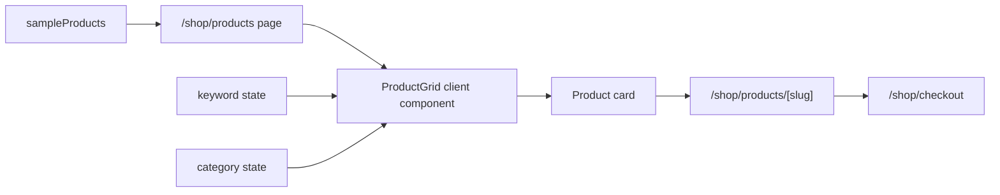

# 商城购物界面升级实施计划

## CEO Review

### 业务价值

- 把当前「两个商品静态陈列」升级为可浏览、可筛选、可检索的轻量 C 端商城。
- 用户进入商城后能按「搜索 -> 分类 -> 商品卡片 -> 详情页 -> 人工确认下单」完成核心路径。
- 继续保持项目边界：商城是轻量 MVP，不接在线支付，不提前锁最终数据库表。

### 用户核心路径

1. 用户进入 `/shop` 或 `/shop/products`。
2. 在搜索栏输入产品名称关键字，列表实时过滤已上架商品。
3. 点击分类入口，展开日用品、上衣、裤子、鞋子、配饰等分类商品。
4. 在桌面端一行浏览 6 个商品；在手机端以 2 个一行的瀑布/货架感布局浏览。
5. 点击商品进入详情页，看到商品主图、价格、销量/库存感知、SKU 选择、数量、物流/服务说明、详情图文区、评价入口占位。
6. 点击「人工确认下单」进入现有 checkout 流程，不提供支付能力。

### Edge Cases

- 搜索结果为空：显示空状态和清除筛选入口。
- 分类无商品：分类面板仍展示，但给出空状态。
- 商品缺少 SKU：详情页禁用下单按钮并展示库存不可用提示。
- 手机屏幕窄：商品卡片固定 2 列，文字截断不撑破卡片，按钮不重叠。
- 未来 API 接入：搜索和分类逻辑保留在组件层，可替换为 `/shop/products` API 查询参数。

### 产品参考矩阵

| 目标 | 淘宝式体验借鉴 | 本项目 MVP 处理 |
| --- | --- | --- |
| 搜索 | 顶部强搜索入口 | 本地关键字过滤商品名称 |
| 分类 | 分类 Tab / 下拉分类货架 | 可展开分类面板 + 分类筛选 |
| 列表 | 高密度商品卡片 | 桌面 6 列，移动 2 列 |
| 详情 | 主图、价格、SKU、数量、服务、详情 | 淘宝式结构，不复制品牌视觉，不接支付 |
| 购买 | 立即购买 / 加购物车 | 保留人工确认下单入口 |

## Eng Review

### 文件清单

- `packages/shared/src/types.ts`
  - 扩展 `Product`：分类 slug、上架状态、价格区间、销量/服务标签、详情图文等轻量字段。
- `packages/shared/src/seed-data.ts`
  - 增加日用品、上衣、裤子、鞋子、配饰等 seed 商品，全部标记为已上架。
- `apps/web/app/shop/products/ProductGrid.tsx`
  - 改为客户端货架组件，支持搜索、分类展开/筛选、空状态、6/2 响应式布局。
- `apps/web/app/shop/products/page.tsx`
  - 继续传入 `sampleProducts`，文案保持现有 i18n 体系。
- `apps/web/app/shop/page.tsx`
  - 首页复用升级后的商品货架。
- `apps/web/app/shop/products/[slug]/page.tsx`
  - 重做为淘宝式详情结构：主图区、购买面板、SKU、数量、服务承诺、商品详情、推荐位。
- `apps/web/app/globals.css`
  - 增加商城专属样式：搜索栏、分类面板、商品网格、商品卡、详情页响应式。

### 数据流

### 依赖与复杂度

- 不新增依赖；可使用已有 `lucide-react` 图标。
- 不新增后端接口，不改变订单 API。
- 复杂度集中在前端展示和 seed data 字段扩展。
- 需要同步确认 `Product` 类型扩展不会破坏 API/admin 页面。

### 验收标准

- `npm run build` 通过。
- `npm run check:residuals` 通过。
- 搜索商品名大小写不敏感，能过滤已上架商品。
- 分类可展开、可点击筛选；至少包含日用品、上衣、裤子、鞋子、配饰。
- 桌面端商品列表 `grid-template-columns: repeat(6, ...)`。
- 手机端商品列表 `grid-template-columns: repeat(2, ...)`，卡片文字不溢出。
- 详情页没有支付入口，但有 SKU、数量、服务、详情、人工确认下单入口。
