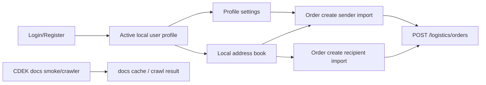

# User Login and Address Book Implementation Plan

## Goal

Build the next user-account slice after the regression baseline: login/profile, sender and recipient address books, and one-click import into logistics order creation, while preserving the backend-owned API integration rule and keeping CDEK API documentation crawlable.

## Regression Baseline

- `npm.cmd run typecheck`: passed.
- `npm.cmd run build`: passed.
- `npm.cmd run check:residuals`: passed.
- `npm.cmd run lint`: blocked by Next.js first-run ESLint configuration prompt, not by a code lint failure.
- CDEK Yuque API docs smoke test: passed. The page returned the CDEK API 2.0 book, 23 TOC items, and 22 docs.

## Success Criteria

- Users can register/login with the existing local development auth path and save personal settings.
- Users can manage common sender addresses and recipient addresses.
- The order creation page can import the active profile, a saved sender, or a saved recipient into the correct sender/recipient fields with visible feedback.
- Address-book data uses one shared business shape compatible with `AddressContact` and future backend persistence.
- No browser-side calls are made to third-party AI or carrier vendors.
- CDEK API manual crawl remains testable by `scripts/crawl-cdek-yuque.mjs` and a non-mutating smoke test.
- Build and typecheck remain green.

## Product Review

Primary user path:

1. A customer signs in or registers.
2. The customer completes personal settings.
3. The customer saves frequently used sender and recipient addresses.
4. During logistics order creation, the customer imports a saved contact instead of retyping address details.
5. The submitted order keeps the same backend payload shape expected by the current logistics API.

Scope for this slice:

- Keep localStorage as the current project-approved lightweight persistence for frontend scaffolding.
- Make the frontend data contract match the backend/Supabase model so it can be replaced later without a UI rewrite.
- Add sender address management because the requirement explicitly mentions common senders, not only recipients.
- Keep document upload and real Supabase Auth/DB writes out of this slice unless separately approved.

Out of scope:

- Online payment.
- Full Supabase Auth client wiring.
- Server-side customer address APIs.
- Admin CRUD for customer addresses beyond existing placeholder visibility.
- Encryption or sensitive document storage.

## Engineering Review

### Existing State

- Web routes already exist for `/auth/login`, `/auth/register`, `/account/profile`, `/account/recipients`, and `/logistics/orders/new`.
- `apps/web/lib/local-user-profile.ts` stores an active user profile and profile index in localStorage.
- `OrderCreateForm` already imports the active profile as sender data.
- `/account/recipients` and `/admin/customers/recipients` currently render `sampleRecipients`.
- `supabase/schema.sql` already includes `user_profiles` and `recipient_addresses`, but the current app does not use them from the frontend.
- NestJS already exposes logistics APIs and Swagger at `/docs`.
- CDEK docs crawler already exists in `scripts/crawl-cdek-yuque.mjs`.

### Proposed Minimal Architecture

Add a browser-local address book utility beside the existing profile utility:

- `apps/web/lib/local-address-book.ts`
- Shared persisted records extend `AddressContact` with `id`, `label`, `kind`, `isDefault`, `createdAt`, and `updatedAt`.
- `kind` is `"sender"` or `"recipient"`.
- Storage is scoped by active profile email where available, with a safe anonymous fallback for early local testing.

Frontend pages:

- Convert `/account/recipients` from static sample cards into a client component for recipient CRUD.
- Add `/account/senders` for sender address CRUD.
- Update site/account navigation only where needed so users can reach profile, senders, recipients, and documents.
- Update `OrderCreateForm` to show saved sender and saved recipient selectors plus one-click import buttons.
- Keep the existing bulk-recipient text parser, but fix its mojibake labels and country aliases.

Backend/API boundary:

- No direct third-party browser calls.
- Keep current logistics order payload unchanged.
- If backend persistence is approved later, add a `customers` or `address-book` Nest module matching the same frontend record shape and Supabase `recipient_addresses` table, extended to support `kind`.

### Data Flow

### File Impact

Likely edits:

- `apps/web/lib/local-address-book.ts`
- `apps/web/app/account/recipients/page.tsx`
- `apps/web/app/account/recipients/AddressBookClient.tsx`
- `apps/web/app/account/senders/page.tsx`
- `apps/web/app/account/senders/AddressBookClient.tsx` or a shared component
- `apps/web/app/logistics/orders/new/OrderCreateForm.tsx`
- `apps/web/components/SiteChrome.tsx`
- `apps/web/lib/i18n.ts`

Possible edits if we choose to prepare backend persistence now:

- `packages/shared/src/types.ts`
- `packages/shared/src/schemas.ts`
- `supabase/schema.sql`
- `apps/api/src/modules/customers/*`
- `apps/api/src/modules/app.module.ts`

Recommended for this slice: do not add backend persistence yet. Keep the surface small and make the local utility schema-compatible.

## Risks

- Existing source has mojibake text in seed data and parts of the recipient parser. Fix only parser labels needed for this feature; avoid broad copy cleanup.
- `lint` cannot run non-interactively until ESLint is configured or the script is migrated. Do not treat this as a feature regression, but record it as tooling debt.
- LocalStorage auth is not production auth. UI should avoid promising real account security until Supabase client wiring is approved.
- Current `.agents/skills/*` git deletions appear unrelated and should not be touched in this slice.

## Verification Plan

- `npm.cmd run typecheck`
- `npm.cmd run build`
- `npm.cmd run check:residuals`
- Non-mutating CDEK docs smoke test
- Manual browser flow:
  - register or login
  - save profile
  - create sender address
  - create recipient address
  - import sender into order form
  - import recipient into order form
  - submit logistics order and see confirmation

## Approval Gate

Pause before implementation. After approval, implement the local address-book slice first, then run verification.
